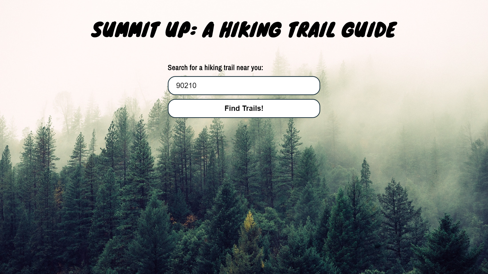

# Summit Up: A Hiking Trail Guide

[Live Version](https://jmlidsky.github.io/summit-up-a-hiking-trail-guide/)

## Summary
Summit Up: A Hiking Trail Guide offers a quick and easy way to find trails around your area. Enter your zip code and you'll see a list of trails within a 25 mile radius along with a photo, location, length, and rating for each. 

## User Guide

Landing page

Input your zip code

Click on the "Find Trails!" button to see results

## Key Technologies Used
- HTML
- CSS
- JavaScript
- jQuery
- LocationIQ API
- Hiking Project API
